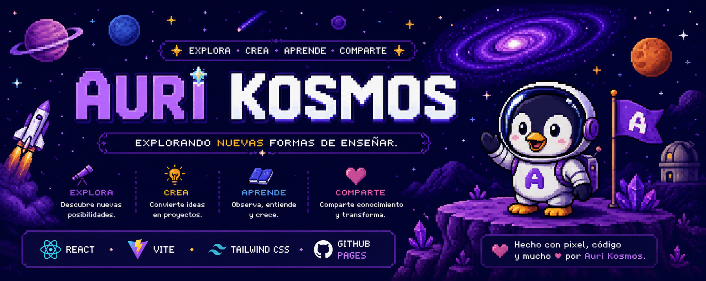
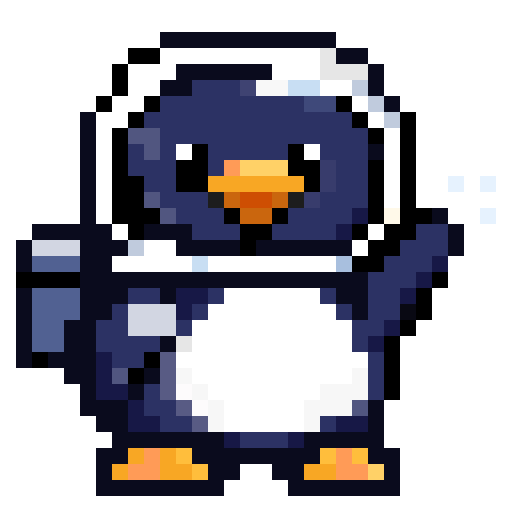
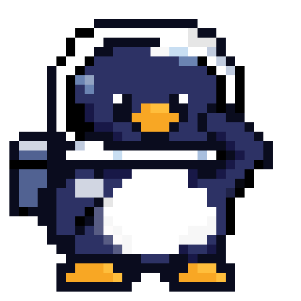
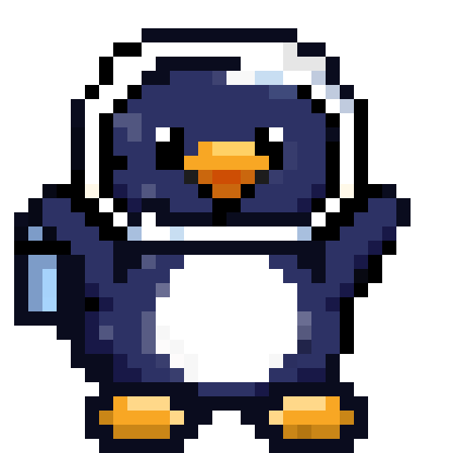
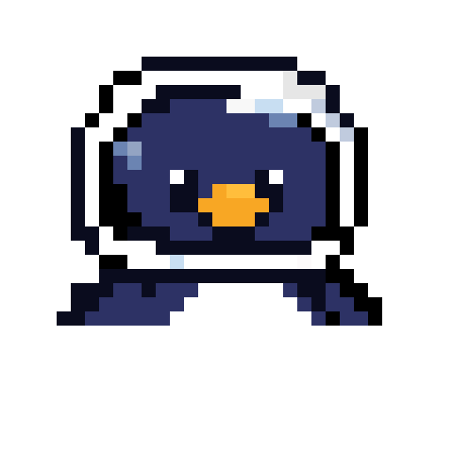

  

<h1 align="center">✨ Auri Kosmos</h1>

<b>Explorando nuevas formas de enseñar.</b>

Una plataforma donde la creatividad, la tecnología y la educación se encuentran para construir experiencias de aprendizaje diferentes.

---

## 👋 Hola, soy Auri

Soy un pequeño pingüino astronauta que viaja por el Kosmos buscando nuevas formas de ayudar a docentes y estudiantes.

Mi misión es convertir ideas en herramientas que hagan el aprendizaje más creativo, divertido y significativo.

---

# 🚀 ¿Qué es Auri Kosmos?

Auri Kosmos es un ecosistema educativo en construcción.

Aquí desarrollamos proyectos que combinan:

- 🎨 Diseño
- 💻 Desarrollo Web
- 🤖 Inteligencia Artificial
- 📚 Recursos para docentes
- 🎮 Gamificación
- 🌎 Tecnología educativa

Cada proyecto es un nuevo planeta dentro del Kosmos.

---

# 🌌 Universo Auri

Cada versión de Auri representa un momento distinto del viaje.

🛰️ Explorando

💡 Creando

🎉 Celebrando

---

# 🛠️ Tecnologías

---

# 🎯 Estado del proyecto

🟢 En desarrollo.

Actualmente estamos construyendo la identidad visual, la landing principal y las primeras herramientas educativas.

---

# 📌 Próximas misiones

- ✅ Landing Page
- 🔄 Blog
- 🔄 Recursos educativos
- 🔄 Biblioteca de herramientas
- 🔄 Plataforma para docentes
- 🔄 IA educativa

---

# 💜 Filosofía

> Aprender también puede sentirse como explorar un universo.

No buscamos hacer otra página web.

Queremos construir un lugar donde enseñar vuelva a ser emocionante.

---

### Auri Kosmos

*Crea • Enseña • Aprende*

