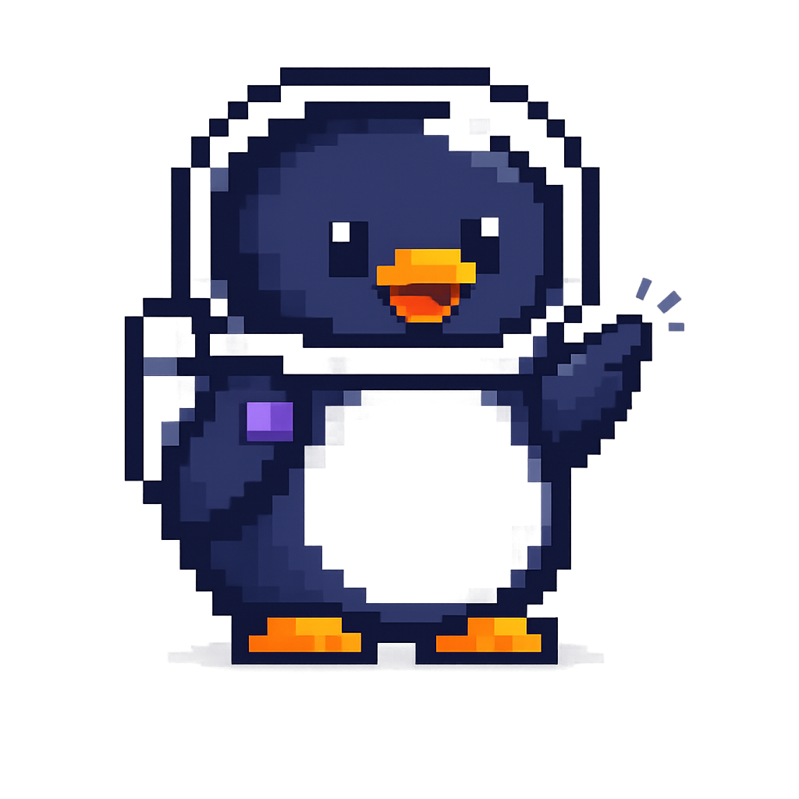
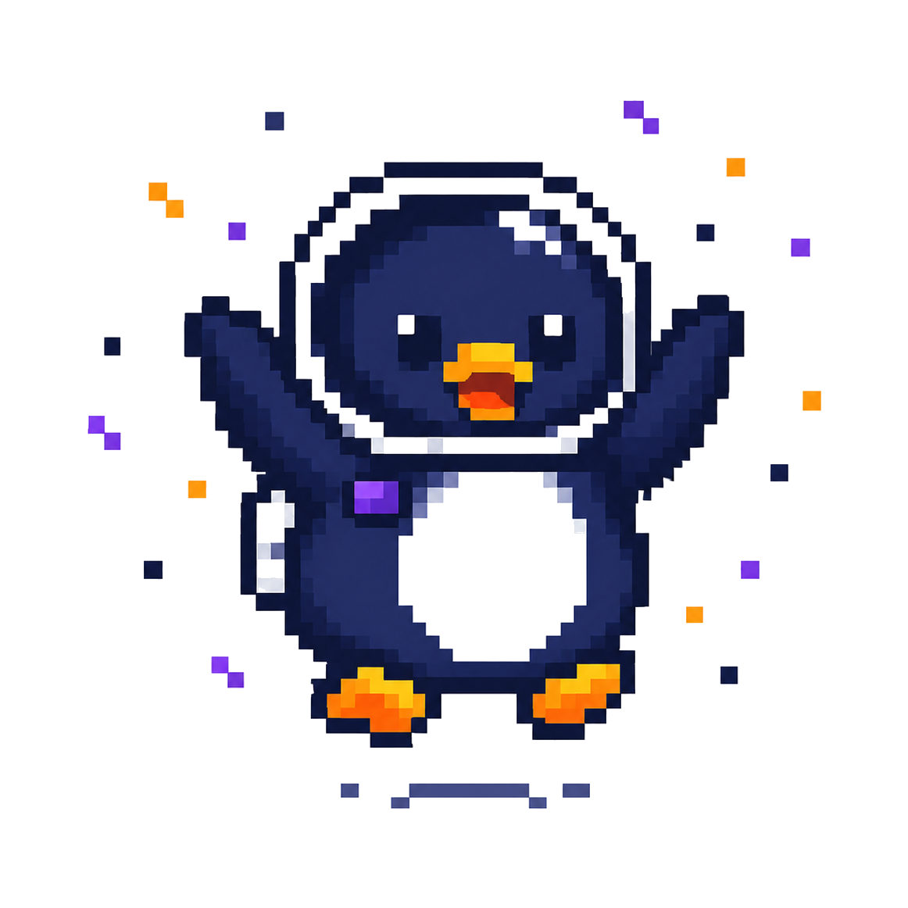

<div align="center">

# 🌌 Auri Kosmos



### ✨ Donde las ideas encuentran su universo.

Una plataforma educativa y creativa diseñada para transformar el aprendizaje mediante tecnología, diseño y experiencias interactivas.

[](https://react.dev/)
[](https://vitejs.dev/)
[](https://tailwindcss.com/)
[](https://pages.github.com/)

---

### 💜 Bienvenido al universo de Auri

</div>

## 🌠 Nuestra visión

En Auri Kosmos creemos que aprender no debe sentirse como una obligación.

Queremos construir experiencias donde la educación, la creatividad y la tecnología trabajen juntas para despertar la curiosidad de cada persona.

Cada proyecto que nace aquí busca acercar el conocimiento de una forma más humana, visual e interactiva.

---

# 🚀 ¿Qué encontrarás?

✨ Recursos educativos

🎲 Laboratorios interactivos

🧩 Juegos didácticos

📚 Herramientas para docentes

🌌 Experiencias digitales

---

# 📸 Vista previa

> Próximamente se añadirá una captura del sitio.

---

# 🛠 Tecnologías

| Tecnología | Uso |
|------------|-----|
| ⚛ React | Interfaz |
| ⚡ Vite | Empaquetador |
| 🎨 Tailwind CSS | Diseño |
| 🐙 GitHub | Control de versiones |
| 🚀 GitHub Pages | Despliegue |

---

# 📂 Estructura

```text
auri-kosmos/
│
├── public/
├── src/
├── package.json
├── vite.config.js
└── README.md
```

---

# 💻 Desarrollo

Instalar dependencias

```bash
npm install
```

Iniciar servidor

```bash
npm run dev
```

Crear versión de producción

```bash
npm run build
```

---

# 🛣 Roadmap

- ✅ Landing Page
- ✅ Sistema de componentes Pixel UI
- 🔄 Laboratorio interactivo
- 🔄 Observatorio educativo
- 🔄 Recursos descargables
- 🔄 Comunidad
- 🔄 Plataforma educativa completa

---

# 🌎 Sitio Web

Cuando GitHub Pages termine de publicarse:

**https://aurikosmos.github.io/aurikosmos/**

---

# 💜 Filosofía

> *"Toda gran aventura comienza con una pregunta."*

Auri no es solamente una mascota.

Es la guía que acompaña cada exploración dentro de este universo.

---

<div align="center">

## ⭐ Si este proyecto te gustó...

¡No olvides darle una estrella al repositorio!



---

Hecho con 💜 por **Auri Kosmos**

</div>
